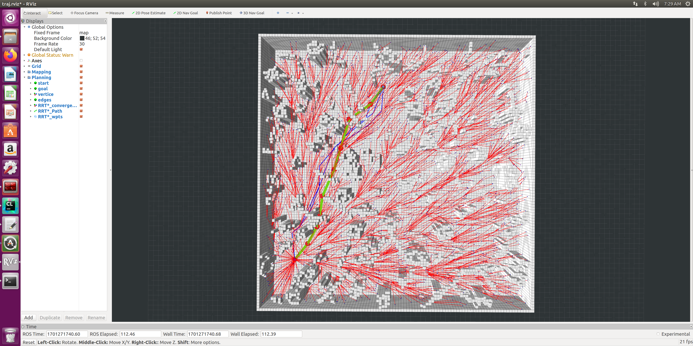

# How to use this package?
1. Create a directory named "catkin_ws" then initialize it(or any other names you like).
2. Copy the src directory into "catkin_ws".
3. Then "catkin_make" and "source devel/setup.bash".
4. Run `source devel/setup.bash`.
5. Run `roslaunch path_finder rviz.launch`.
6. Run `roslaunch path_finder test_planners.launch`.

Tips: Remove the loop of choose parent and rewire then it will convert back into rrt algorithm.

## The figure shows rrt_star plan result:

